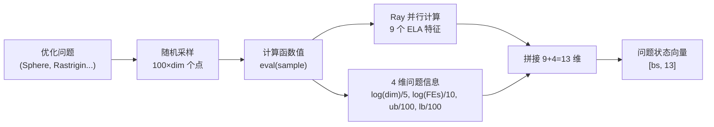
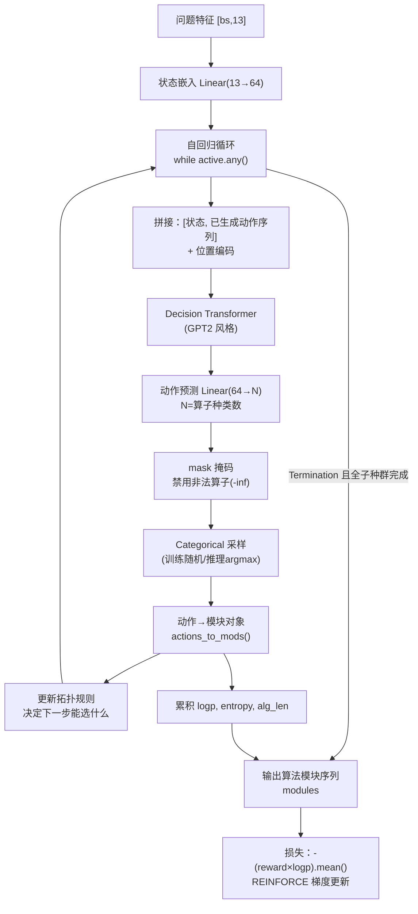
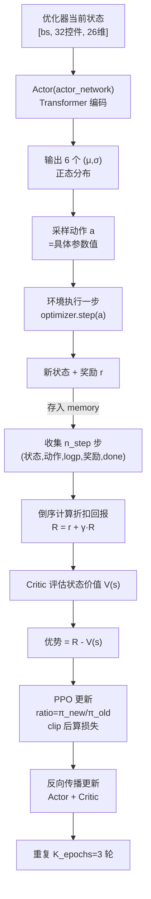
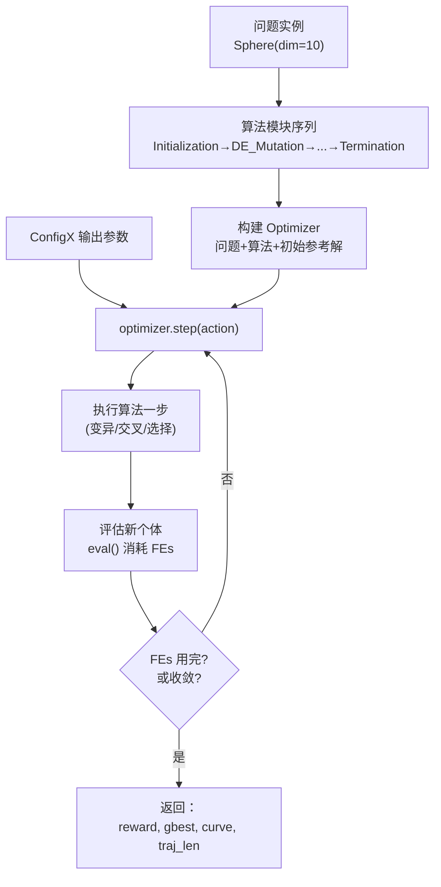
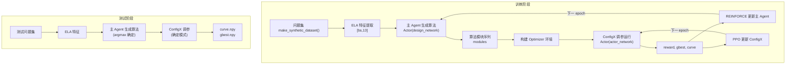

# DesignX 完整工作流程

## 全景架构

```
┌─────────────────────────────────────────────────────────────────────┐
│                          main.py（入口）                             │
│   解析参数 → 创建 REINFORCE 主 Agent → train 或 test 模式            │
└──────────────────────────────┬──────────────────────────────────────┘
                               │
                ┌──────────────▼──────────────┐
                │   主 Agent（REINFORCE）      │
                │   设计算法结构（骨架）        │
                │   ├─ Actor(design_network)  │
                │   └─ REINFORCE 梯度更新      │
                └──────────────┬──────────────┘
                               │ 生成算法模块序列
                ┌──────────────▼──────────────┐
                │   副 Agent（ConfigX）        │
                │   运行时动态调参（血肉）      │
                │   ├─ Actor(actor_network)   │
                │   ├─ Critic（价值评估）      │
                │   └─ PPO 更新               │
                └──────────────┬──────────────┘
                               │ 输出参数 (μ,σ)
                ┌──────────────▼──────────────┐
                │  环境（Optimizer）           │
                │  问题 + 算法 + 参数 = 运行    │
                │  → 返回奖励和最终解           │
                └─────────────────────────────┘
```

---

## 模块 1：问题特征提取（ELA）

### 数据流



````

### 讲解

**ELA（探索性景观分析）** 回答一个问题："这个优化问题长什么样？"

通过随机采样 100×dim 个点，计算它们的函数值，然后提取 9 个统计特征：

- 这个函数是平滑的还是崎岖的？
- 单峰还是多峰？
- 有没有全局趋势？

这 9 个特征 + 4 个问题元信息（维度、预算、边界）= **13 维的问题描述**，喂给主 Agent。

**一句话**：ELA 是"给优化问题拍 X 光片"，让 AI 先看清问题地貌再设计算法。

---
````

## 模块 2：主 Agent 生成算法（REINFORCE）

### 数据流



````

### 讲解

主 Agent 像一个**算法设计师**，逐模块地"写"出一个优化算法：

1. 看问题特征（13 维）。
2. 第一步只能选 `Initialization`（初始化种群）。
3. 每一步从算子池里挑一个模块（DE 变异、交叉、选择等）。
4. **拓扑规则**约束：选了变异必须跟交叉，不能乱选。
5. 直到选出 `Termination`（终止），算法完成。

**训练方式：REINFORCE**。生成的算法在问题上运行，得到奖励 R。损失 = `-(R × logp)`：

- 好算法（高奖励）→ 提高生成它的概率。
- 差算法（低奖励）→ 降低生成它的概率。

**一句话**：主 Agent 是"总设计师"，看着问题地貌，一步步画出算法的骨架，画得好就奖励、画得差就惩罚。

---
````

## 模块 3：副 Agent 动态调参（ConfigX + PPO）

### 数据流



````

### 讲解

ConfigX 是**现场工程师**，在算法运行过程中实时调参：

1. 看优化器当前状态（种群分布、代数等）。
2. 输出每个参数的正态分布 (μ, σ)。
3. 采样出具体参数值，喂给优化器执行。
4. 收集一段轨迹（n_step 步），存入 memory。
5. 倒序计算折扣回报，Critic 评估状态价值。
6. 优势 = 实际回报 - Critic 基线。
7. PPO 更新：用 clip 限制更新幅度，防止策略突变。

**训练方式：PPO**。Actor 决策，Critic 打分，优势函数衡量"这次比预期好多少"。

**一句话**：ConfigX 是"现场工程师"，一边看优化器运行状态，一边实时拧参数旋钮，拧得好 Critic 给高分、拧得差给低分。

---
````

## 模块 4：环境（Optimizer）执行优化

### 数据流



````

### 讲解

环境把"问题 + 算法 + 参数"三者合体，真正运行优化：

1. 初始种群随机生成。
2. 按算法模块执行变异、交叉、选择。
3. 每评估一次个体消耗 1 个 FEs（函数评估次数）。
4. FEs 用完或收敛时结束。
5. 返回：奖励（最终解质量）、最优解、收敛曲线、轨迹长度。

**一句话**：环境是"考场"，把总设计师的图纸和现场工程师的参数组合起来，实际跑一遍优化，给出得分。

---
````

## 模块 5：训练 vs 测试

### 训练模式


make_synthetic_dataset() → 训练问题集
    ↓
for epoch in range(100):
    for batch in 训练集:
        ① ELA 提取问题特征
        ② 主 Agent 生成算法
        ③ ConfigX 调参运行 → 得 reward
        ④ REINFORCE 更新主 Agent（-(R×logp)）
        ⑤ ConfigX.update() → PPO 更新副 Agent
    保存 checkpoint
    周期性 rollout 验证
```

### 测试模式

```
加载主 Agent + ConfigX 权重
    ↓
rollout(测试问题集):
    ① ELA 提取特征
    ② 主 Agent 生成算法（argmax 确定模式）
    ③ ConfigX 调参运行（确定模式）
    ↓
保存 curve、gbest 到 .npy 文件
```

---

## 🎯 完整数据流总图

````



---

## 📝 一句话记忆口诀

> **DesignX 是"双智能体自动设计优化算法"系统：主 Agent（REINFORCE）当总设计师，先给优化问题拍 X 光片（ELA 特征），再按拓扑规则一步步挑选算子拼出算法骨架；副 Agent（ConfigX）当现场工程师，在算法运行时盯着优化器状态实时拧参数旋钮；优化器当考场，跑完给出奖励；主 Agent 用奖励 × 对数概率（REINFORCE）学"怎么设计好算法"，副 Agent 用优势函数和概率比裁剪（PPO）学"怎么调好参数"。**

更短版：

> **"拍片（ELA）→ 画图（主 Agent 生成算法）→ 调参（ConfigX）→ 考试（Optimizer）→ 打分（reward）→ 两兄弟各自学习（REINFORCE + PPO）"**

---

## 🧠 五个模块速记表

|模块|角色|输入|输出|训练方法|
|---|---|---|---|---|
|ELA 特征|侦察兵|优化问题|13 维问题描述|无（统计）|
|主 Agent|总设计师|问题特征|算法模块序列|REINFORCE|
|ConfigX|现场工程师|优化器状态|参数 (μ,σ)|PPO|
|Optimizer|考场|问题+算法+参数|奖励/最优解|无（执行）|
|rollout|考官|测试集|curve/gbest|无（评估）|

---
